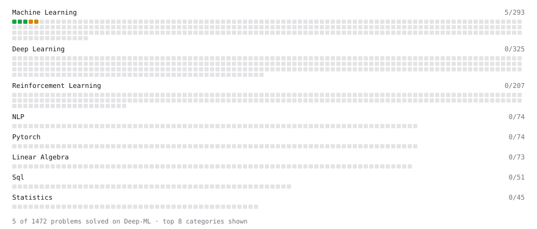

# Deep-ML

My machine learning practice from [Deep-ML](https://www.deep-ml.com). Every solution here was written by hand.

**7** solved · 7 problems · 0 labs · 0 math

[**Browse the interactive portfolio**](https://gf-gonzalez.github.io/deep-ml/) to replay this filling in over time.

## Problems

| | Difficulty | Solved | |
| --- | --- | --- | --- |
| [Feature Scaling Implementation](https://www.deep-ml.com/problems/16) | easy | 2026-09-28 | [solution](problems/0016-feature-scaling-implementation) |
| [Linear Regression Using Gradient Descent](https://www.deep-ml.com/problems/15) | easy | 2026-09-20 | [solution](problems/0015-linear-regression-using-gradient-descent) |
| [Linear Regression Using Normal Equation](https://www.deep-ml.com/problems/14) | easy | 2026-09-19 | [solution](problems/0014-linear-regression-using-normal-equation) |
| [Single Neuron](https://www.deep-ml.com/problems/24) | easy | 2026-09-28 | [solution](problems/0024-single-neuron) |
| [Implement K-Fold Cross-Validation](https://www.deep-ml.com/problems/18) | medium | 2026-09-28 | [solution](problems/0018-implement-k-fold-cross-validation) |
| [K-Means Clustering](https://www.deep-ml.com/problems/17) | medium | 2026-09-28 | [solution](problems/0017-k-means-clustering) |
| [Principal Component Analysis (PCA) Implementation](https://www.deep-ml.com/problems/19) | medium | 2026-09-28 | [solution](problems/0019-principal-component-analysis-pca-implementation) |

---

_This file is regenerated by Deep-ML on every push._
